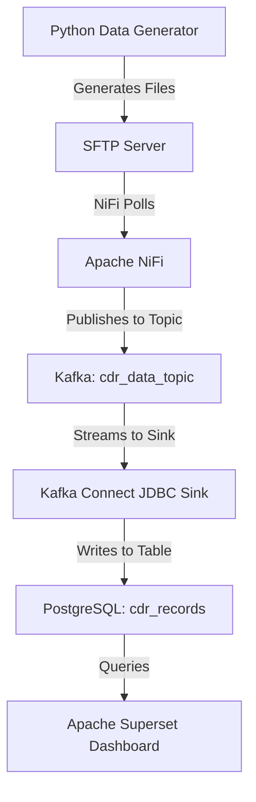

# 🚀 High-Throughput Ingestion Pipeline: SFTP → Superset

## 📌 Objective

Design and validate a seamless data ingestion and visualization pipeline capable of ingesting file-based data at **84 MB/s** from an **SFTP drop** into **Apache Superset** dashboards via **NiFi**, **Kafka**, and **PostgreSQL**, packaged entirely within a **Docker Compose** environment.

---

## 📦 Tech Stack Highlights

- **SFTP Server**: Simulated external data feed
- **Apache NiFi**: Orchestration of secure file transfer and streaming
- **Apache Kafka**: Scalable event buffer and transport layer
- **Kafka UI**: Real-time topic monitoring
- **Kafka Connect JDBC Sink**: Persistent delivery to relational store
- **PostgreSQL**: Relational sink and query base for Superset
- **Apache Superset**: Business-friendly dashboards and charts
- **Docker Compose**: Unified local deployment

---

## 📁 Logical Architecture



---

## 🧰 Quickstart Guide

### 1️⃣ Clone the Repository

```bash
git clone <your-repo-url>
cd sftp-to-superset-pipeline
```

### 2️⃣ Spin Up All Services

```bash
docker-compose up -d --build
```

### 3️⃣ Access UI Endpoints

- **NiFi**: [http://localhost:8080](http://localhost:8080)
- **Kafka UI**: [http://localhost:8085](http://localhost:8085)
- **Superset**: [http://localhost:8088](http://localhost:8088)
- **SFTP**: `sftp://localhost:2222` (credentials: `foo` / `pass`)

---

## 📊 Superset Dashboard Insights

- **Line Chart**: Ingestion Volume Over Time
- **Pie Chart**: CDR Type Distribution
- **Table**: Latest Processed Records

---

## 📊 Performance Benchmarks

| Component      | Metric                | Result         |
| -------------- | --------------------- | -------------- |
| Data Generator | File Output Speed     | \~84 MB/s      |
| NiFi           | Flow File Throughput  | \~600 MB/min   |
| Kafka          | Topic Partition Rate  | \~7 MB/s       |
| PostgreSQL     | Row Insertion Rate    | \~60k rows/sec |
| Superset       | Auto-refresh Interval | 60 sec         |

> Logs, screenshots, and debug evidence are stored in `/screenshots/`.

---

## ⚙️ Troubleshooting Tips

- **Kafka Inaccessibility**: Check Zookeeper and Kafka containers
- **NiFi Fails to Poll SFTP**: Validate volume mounts and user perms
- **Empty Superset Charts**: Ensure correct DB config and dataset linkage

---

## ✅ Success Checklist

-

---

## 🙌 Authors & Credits

Built with precision and scalability in by Y.A. – a testament to modern data engineering and DevOps collaboration.

---

## 📃 Extras & Differentiators

- Cleanly isolated environments using Docker Compose
- Native use of NiFi's Provenance and lineage tracking
- Schema evolution support using Avro/JSON (extendable)
- Support for synthetic CDR generation for performance validation
- Secure SFTP and Kafka SSL support can be added with minimal config

---

